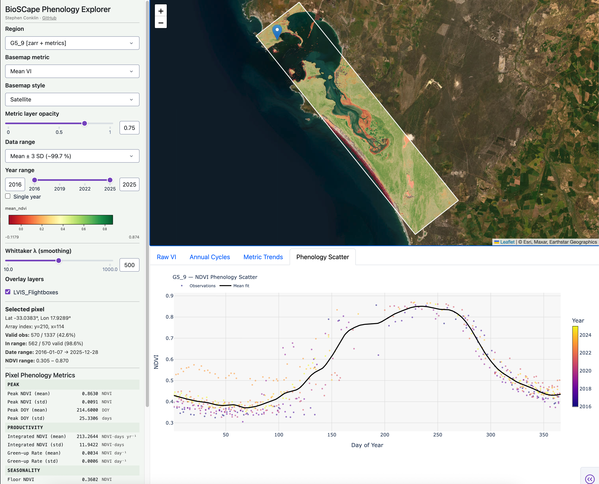

# BioSCape Phenology Explorer

An interactive web dashboard for exploring vegetation index (VI) phenology across BioSCape LVIS flight box regions. Built on Plotly Dash and Dash-Leaflet, and deployable to Plotly Cloud or any Gunicorn-compatible host.

[](docs/images/BioSCape-Phenology-Explorer-Dashboard.png)

---

## Background

The [BioSCape](https://bioscape.io) (Biodiversity Survey of the Cape) project is a NASA airborne campaign focused on characterizing biodiversity and ecosystem function across the Cape Floristic Region of South Africa — one of the world's most biodiverse and threatened ecosystems.

This dashboard is part of a broader phenology analysis workflow:

1. **HLS 2.0** — Harmonized Landsat Sentinel-2 imagery at 30 m resolution provides the foundational spectral time series across BioSCape study areas.
2. **[HLS_VI_Pipeline](https://github.com/stephenconklin/HLS_VI_Pipeline)** — Procures and processes HLS 2.0 data into vegetation index (VI) datacubes, tiled and organized by LVIS flight box region.
3. **[VI_Phenology](https://github.com/stephenconklin/VI_Phenology)** — Extracts phenological metrics (peak VI, green-up, senescence, growing season length, etc.) from the VI datacubes using Whittaker smoothing.
4. **BioSCape Phenology Explorer** *(this dashboard)* — Provides researchers with an interactive interface to explore per-pixel phenology across LVIS flight box regions, visualize spatial patterns, and extract time series on demand.

---

## Features

- **Interactive map** with LVIS flight box overlays — click a polygon to select a study region
- **Spatial basemap** rendering of phenology metrics (peak NDVI, mean VI, data coverage, and 19 precomputed metrics) at near-native 30 m resolution
- **Per-pixel time series** extraction with Whittaker smoothing applied on the fly
- **Phenology charts**: raw VI time series, annual cycle composites, interannual metric trends, and phenology scatter plots
- **Multiple basemap styles**: Satellite, Topographic, Shaded Relief, OpenStreetMap, or no basemap
- **Lazy data loading** via Dask — full datacubes are never loaded into memory
- **GCS-native** — reads Zarr stores directly from Google Cloud Storage

---

## Data

Data are hosted in the `bioscape_phenology_data` GCS bucket. Each region corresponds to a BioSCape LVIS flight box (e.g. `G5_8`) and is produced by the upstream HLS_VI_Pipeline and VI_Phenology pipelines.

| File | Description |
|---|---|
| `<region>_<VI>_datacube.zarr/` | VI time-series datacube (Zarr v3, rechunked for fast pixel reads) |
| `<region>_pixel_metrics.nc` | Precomputed 19-metric phenology summary per pixel |

> **Note:** Zarr stores use the v3 format (`zarr.json` marker). Requires `zarr >= 3.0`.

See [`tools/convert_to_zarr.py`](tools/convert_to_zarr.py) and [`tools/pixel_phenology_extract.py`](tools/pixel_phenology_extract.py) for offline data preparation utilities.

---

## Setup

### Requirements

Python 3.11+ recommended.

```bash
pip install -r requirements.txt
```

### Configuration

All settings live in [`config.py`](config.py). Common overrides via environment variables:

| Variable | Description | Default |
|---|---|---|
| `VI_DATACUBE_ROOT` | Data root — local path or `gs://` URI | `gs://bioscape_phenology_data/` |
| `GOOGLE_SERVICE_ACCOUNT_JSON` | Full JSON content of a GCP service account key (for private buckets) | — |
| `GCS_TOKEN` | Auth method: `anon` or `google_default` | `google_default` |

Map overlays are configured directly in [`config.py`](config.py) via the
`SHAPEFILE_LAYERS` list — one tuple per overlay: `(filename in shapefiles/,
display label, selectable, visible-by-default)`. `selectable=False` renders the
layer non-interactive so clicks pass through to the flight boxes beneath it
(used for the HLS tile grid).

### Running Locally

```bash
python app.py
```

App available at `http://localhost:8050`.

### Deployment (Plotly Cloud / Gunicorn)

```bash
gunicorn app:server
```

Set `GOOGLE_SERVICE_ACCOUNT_JSON` in your platform's environment variables with the full contents of a service account JSON key that has **Storage Object Viewer** access to the data bucket.

### Docker Deployment (e.g. Jetstream2)

A `Dockerfile` and `docker-compose.yml` are included for deploying to a plain VM
with a locally-mounted data volume (no GCS credentials required). `docker-compose.yml`
is checked in pre-configured for the project's Jetstream2 instance — edit the
`volumes:` path if deploying elsewhere.

```bash
docker compose up -d --build
```

This builds the image, starts the container bound to host port 80 (mapped to
gunicorn on 8050 inside the container), and mounts the data volume read-only at
`/data` with `VI_DATACUBE_ROOT=/data` set automatically. `restart: unless-stopped`
keeps it running across container crashes and VM reboots (as long as the Docker
daemon itself starts on boot, which is the default on Ubuntu).

Before starting, confirm the volume path in `docker-compose.yml` actually exists
on the host and contains `<region>_<VI>_datacube.zarr` / `<region>_pixel_metrics.nc`
files — the container will start regardless, but `discover_regions()` finds
nothing and the region dropdown will be empty.

**Firewall note:** exposing port 80 also requires the VM's cloud-provider
security group (e.g. Jetstream2's OpenStack security group, configured via the
Horizon dashboard or `openstack` CLI) to allow inbound TCP/80 — this is outside
Docker's control and must be opened separately.

Useful commands:

```bash
docker compose logs -f dashboard   # tail logs
docker compose down                # stop
docker compose up -d --build       # redeploy after a code change
```

---

## Project Structure

```
app.py                        # Dash application — layout and callbacks
config.py                     # Tuneable constants and environment variable overrides
requirements.txt              # Python dependencies
Procfile                      # Gunicorn entry point for cloud deployment
Dockerfile                    # Container image build (gunicorn on port 8050)
docker-compose.yml            # Docker Compose deployment (volume mount, port 80, restart policy)
.dockerignore                 # Files excluded from the Docker build context
modules/
  datacube_io.py              # Region discovery, dataset loading, pixel extraction
  visualization.py            # Map helpers, tile services, shapefile loading, chart rendering
  phenology_metrics.py        # Whittaker smoothing and phenological metric computation
shapefiles/
  LVIS_Flightboxes_densified.geojson  # LVIS flight box polygons (densified edges — used by the app)
  LVIS_Flightboxes.geojson            # Original flight box polygons (corner vertices only)
  BioSCape_HLS_Tiles.geojson          # HLS tile boundaries (optional overlay)
tools/
  convert_to_zarr.py          # Rechunk NetCDF → Zarr for faster GCS pixel reads
  pixel_phenology_extract.py  # Batch-compute per-pixel phenology metrics
  cache_basemaps.py           # Pre-render basemap cache files (.npz)
  densify_flightboxes.py      # Densify flight box edges so they follow the curved UTM→WGS84 path
```

---

## Related Repositories

| Repository | Description |
|---|---|
| [HLS_VI_Pipeline](https://github.com/stephenconklin/HLS_VI_Pipeline) | Procures and processes HLS 2.0 data into VI datacubes |
| [VI_Phenology](https://github.com/stephenconklin/VI_Phenology) | Extracts phenological metrics from VI datacubes |

---

## License

MIT — see [LICENSE](LICENSE).
